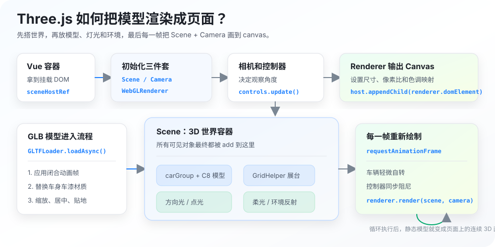

## 前言

最近研究了一下 `Three.js`，立马想到给兄弟们整点福利。

我替兄弟们试了，车是好车，开起来很丝滑。当然，先别急着提车，车停到浏览器里。

## 如何 40 岁之前开上跑车？


大家小时候是不是都有一个跑车梦？尤其是看过《速度与激情》之后，对美系跑车更容易上头。

虽然现实里跑车不一定开得上，但是还有第二条路：用 `Three.js` 做一辆 3D 跑车，至少虚拟世界里先安排上。

这篇文章适合刚接触 `Three.js` 的同学。我们不讲太复杂的引擎架构，先把一个完整的 3D 汽车展示案例跑起来，并拆清楚这些问题：

1. 3D 模型从哪里来；
2. 模型如何加载到浏览器；
3. 场景、相机、灯光、渲染器分别负责什么；
4. 车漆为什么不能只改一个颜色；
5. Vue 组件卸载时为什么要清理 Three.js 资源。

## 模型来源

在使用 `Three.js` 渲染 3D 产品之前，需要先有模型。`Three.js` 不是“凭空生成一辆车”的工具，它更像是一个把 3D 模型渲染到浏览器里的引擎。

前端通常不会自己建模，而是使用设计师、3D 建模师或素材平台提供的 `.glb / .gltf` 模型。这个案例使用的是：

[Animated Chevrolet C8 Model - Sketchfab](https://sketchfab.com/3d-models/animated-chevrolet-c8-model-91d39ff24d6c4e7b83674411f9c5bb67)

这个模型是 `CC Attribution` 授权，使用时需要保留作者署名。当前项目已经把运行时使用的 GLB 放到了当前案例的 `models` 文件夹下，模型和页面代码放在一起，方便后面查看和迁移。

## 页面结构

这个案例的 DOM 结构很简单：3D 画面交给 `showcase-canvas`，标题、参数和色卡依然用普通 DOM 写。

```vue
<template>
  <main class="car-showcase-page">
    <div ref="sceneHostRef" class="showcase-canvas"></div>

    <section class="showcase-copy" aria-label="产品信息">
      <p>Animated Sports Car Showcase</p>
      <h2>Chevrolet Corvette C8</h2>
      <dl>
        <div>
          <dt>Engine</dt>
          <dd>LT2 V8</dd>
        </div>
        <div>
          <dt>Power</dt>
          <dd>495hp</dd>
        </div>
        <div>
          <dt>Type</dt>
          <dd>Mid-engine</dd>
        </div>
      </dl>
      <span v-if="modelNote" class="model-note">
        {{ modelNote }}
      </span>
    </section>

    <section class="paint-panel" aria-label="车漆颜色">
      <button
        v-for="paint in paintOptions"
        :key="paint.name"
        type="button"
        class="paint-swatch"
        :class="{ 'paint-swatch--active': activePaint === paint.name }"
        :style="{ backgroundColor: paint.color }"
        :aria-label="paint.label"
        :aria-pressed="activePaint === paint.name"
        @click="applyPaint(paint)"
      ></button>
    </section>
  </main>
</template>
```

这样做的好处是：`Three.js` 只负责画车，Vue 仍然负责页面结构和交互状态。代码边界会清楚很多。

## 页面高度

当前案例运行在博客的 demo 预览页里，外层已经有站点 Header、demo Header 和 Footer，所以组件根节点不要再写 `min-height: 100vh`。

最新代码里让汽车页面继承中间舞台的高度，并由组件内部隐藏溢出：

```less
.car-showcase-page {
  position: relative;
  height: 100%;
  min-height: 0;
  overflow: hidden;
  background: #090d12;
  color: #f8fafc;
}

.showcase-canvas {
  position: absolute;
  inset: 0;
}
```

`showcase-canvas` 铺满整个组件，Three.js 生成的 `canvas` 会挂进去。上层的车型文案和色卡通过 `position` 覆盖在 3D 画面上。

## 模型路径

代码里用了一个模型地址：

```ts
const corvetteModelUrl = new URL('./models/chevrolet-corvette-c8.glb', import.meta.url).href
```

`corvetteModelUrl` 指向当前组件旁边的 `models/chevrolet-corvette-c8.glb`。

为什么放在当前案例目录？

因为这个模型只服务于 `car-basic` 这个案例，不是全站公共资源。放到当前案例目录后，Vite 会把它当成模块资源处理，最终构建时自动生成正确的资源地址。

写法是：

```ts
new URL('./models/chevrolet-corvette-c8.glb', import.meta.url)
```

这种写法的好处是路径跟着文件走。以后如果把整个 `car-basic` 文件夹移动到别处，模型路径也不容易散。

目录结构大致是：

```text
car-basic/
├─ index.md
├─ index.vue
├─ render-flow.svg
└─ models/
   └─ chevrolet-corvette-c8.glb
```

## 加载模型

基础版直接使用 `GLTFLoader` 加载 C8 模型：

```ts
const loadCarModel = async () => {
  try {
    const loader = new GLTFLoader()
    const gltf = await loader.loadAsync(corvetteModelUrl)
    const model = gltf.scene

    if (!scene) {
      disposeObject(model)
      return
    }

    applyInitialAnimationPose(model, gltf.animations)
    prepareCarModel(model)
    fitModelToStage(model)

    carGroup = new THREE.Group()
    carGroup.add(model)
    carGroup.rotation.y = -0.52
    scene.add(carGroup)
  } catch (error) {
    modelNote.value = '模型加载失败，请检查模型文件路径。'
    console.error('Failed to load car model:', error)
  }
}
```

这里加载成功后没有马上丢进场景，而是先做了几步处理：

1. `applyInitialAnimationPose`：把模型自带动画压到闭合状态；
2. `prepareCarModel`：隐藏模型底座、开启阴影、替换车身材质；
3. `fitModelToStage`：缩放、居中、贴地；
4. `carGroup.add(model)`：用一个外层 `Group` 包住整车，后面自转时只转这个 `Group`。

如果模型加载失败，就把提示写入 `modelNote`，页面上会出现错误信息。

## 创建场景

`Three.js` 最核心的三个对象是：

```ts
scene = new THREE.Scene()
camera = new THREE.PerspectiveCamera(25, width / height, 0.1, 100)
renderer = new THREE.WebGLRenderer({ antialias: true })
```

可以这样理解：

1. `scene` 是 3D 世界；
2. `camera` 是观察这个世界的眼睛；
3. `renderer` 是把 3D 世界画成 canvas 的渲染器。



这张图可以按一句话理解：模型、灯光、展台和环境都放进 `scene`，`camera` 决定从哪里看，`renderer.render(scene, camera)` 负责把这一刻的 3D 世界画到页面里的 `canvas` 上。

初始化完成后，把 canvas 挂到 Vue 的容器里：

```ts
host.appendChild(renderer.domElement)
```

## 色彩空间和色调映射

代码里有几行很关键：

```ts
renderer.outputColorSpace = THREE.SRGBColorSpace
renderer.toneMapping = THREE.ACESFilmicToneMapping
renderer.toneMappingExposure = 0.6
```

`outputColorSpace` 会影响颜色在浏览器里的显示。如果不处理，模型颜色可能偏灰或者不准。

`toneMapping` 可以理解成把 3D 渲染中的高光和暗部映射成屏幕上更舒服的颜色。汽车展示很依赖高光，所以这里用了 `ACESFilmicToneMapping`。

`toneMappingExposure` 是曝光值。过高会让车漆高光炸白，过低又会显得没质感，所以这里设置得比较克制。

## 环境反射

汽车车漆是否真实，很大程度取决于反射。

基础版使用 `RoomEnvironment` 生成环境贴图：

```ts
const pmremGenerator = new THREE.PMREMGenerator(renderer)
environmentMap = pmremGenerator.fromScene(new RoomEnvironment(), 0.04)
scene.environment = environmentMap.texture
pmremGenerator.dispose()
```

`scene.environment` 可以理解成“周围环境的反光来源”。

车漆、玻璃、金属这些材质都会从环境贴图里拿到反射信息。如果没有它，车身会显得很平，像普通彩色模型。

## 灯光

基础版里用了几种不同的光：

```ts
const keyLight = new THREE.DirectionalLight('#ffffff', 1.45)
const fillLight = new THREE.DirectionalLight('#f8fafc', 0.28)
const rimLight = new THREE.PointLight('#ffffff', 14, 12)
const ambientLight = new THREE.HemisphereLight('#f8fafc', '#020617', 0.5)

scene.add(keyLight, fillLight, rimLight, ambientLight)
```

可以按摄影棚理解：

1. `keyLight` 是主光，负责打出主要亮面；
2. `fillLight` 是补光，避免暗部死黑；
3. `rimLight` 是轮廓光，让车从深色背景里分离出来；
4. `HemisphereLight` 是环境底光，给整体一点基础亮度。

另外还加了两盏矩形柔光：

```ts
RectAreaLightUniformsLib.init()

const frontSoftbox = new THREE.RectAreaLight('#ffffff', 0.95, 4.6, 1.5)
const sideSoftbox = new THREE.RectAreaLight('#dbeafe', 0.45, 3.8, 1.4)
scene?.add(frontSoftbox, sideSoftbox)
```

`RectAreaLight` 更像摄影棚里的柔光箱，适合让车漆产生大块、柔和的高光。`RectAreaLightUniformsLib.init()` 是为了初始化它需要的 shader 支持。

## 展台和初始镜头

基础版现在只保留网格参考线：

```ts
const grid = new THREE.GridHelper(18, 36, '#475569', '#1f2937')
grid.position.y = 0.018
scene?.add(grid)
```

`GridHelper` 画出来的是线条，不是实心地板。这样既能保留空间方向，又不会出现车底下面一整块黑色平面。

之前外面有一个白色光圈，本质上是用 `TorusGeometry` 画出来的圆环：

```ts
new THREE.TorusGeometry(3.45, 0.018, 12, 128)
```

这个圆环视觉存在感比较强，会抢走车本身的注意力，所以现在基础版和交互版都删除了它，只保留网格。

初始镜头也稍微靠近了一点：

```ts
camera.position.set(5.15, 2.55, 4.85)
controls.target.set(0, 0.82, 0)
controls.maxPolarAngle = Math.PI / 2.05
```

`camera.position.set(x, y, z)` 可以理解成把相机放到 3D 空间里的某个位置。

当前这组值表示：相机在车的右前上方，看向车身中心附近。相比更远的镜头，汽车初始状态会更大一些，更像产品展示页。

`controls.maxPolarAngle` 用来限制相机向下绕的最大角度。这里略小于 `Math.PI / 2`，目的是避免用户把相机拖到地面以下。

## 动画初始帧

这个 C8 模型自带动画，而且末帧是闭合状态。为了避免页面刚打开时车门、机盖是打开的，基础版会把所有动画直接推进到末帧：

```ts
const applyInitialAnimationPose = (model: THREE.Object3D, animations: THREE.AnimationClip[]) => {
  if (!animations.length) {
    return
  }

  const mixer = new THREE.AnimationMixer(model)
  let closeTime = 0

  animations.forEach((clip) => {
    const action = mixer.clipAction(clip)
    closeTime = Math.max(closeTime, clip.duration)
    action.setLoop(THREE.LoopOnce, 1)
    action.clampWhenFinished = true
    action.play()
  })

  mixer.setTime(closeTime)
}
```

这里的 `animations` 来自 `gltf.animations`，也就是模型导出时自带的动画片段。如果某个模型没有动画，这里就是空数组。

## 模型适配展台

不同来源的 3D 模型尺寸差别很大，有的按米建模，有的按厘米建模，原点也不一定在车身中心。

所以加载模型后，要统一做三件事：

```ts
const box = new THREE.Box3().setFromObject(model)
const size = box.getSize(new THREE.Vector3())
const maxSize = Math.max(size.x, size.y, size.z)

model.scale.setScalar(5.4 / maxSize)
```

第一步：用 `Box3` 获取模型包围盒。

第二步：根据最长边把模型缩放到合适大小。

第三步：居中并贴地：

```ts
const centeredBox = new THREE.Box3().setFromObject(model)
const center = centeredBox.getCenter(new THREE.Vector3())
model.position.sub(center)

const finalBox = new THREE.Box3().setFromObject(model)
model.position.y -= finalBox.min.y
```

这样无论原模型大小如何，都能比较稳定地放进当前展台。

## 车漆配置

当前车漆数据已经抽到了共享目录：

```ts
import { paintOptions, type PaintOption } from '../../../content-data/animation.ts'
```

`paintOptions` 里不仅有色值，还有控制 PBR 质感的参数：

```ts
export const paintOptions: PaintOption[] = [
  {
    name: 'corvette-red',
    label: 'Corvette Red',
    color: '#8f1418',
    metalness: 0.16,
    roughness: 0.22,
    clearcoatRoughness: 0.03,
    reflectivity: 0.68,
    envMapIntensity: 1.36,
    pearl: 0.04,
  },
]
```

这里故意把红色放在第一个，同时让 `activePaint` 默认等于 `corvette-red`：

```ts
const activePaint = ref('corvette-red')
```

这样页面打开时，默认车漆和第一个色卡是对应的。

## 车漆材质

汽车车漆不能简单地用纯色覆盖。

如果直接这样写：

```ts
new THREE.MeshPhysicalMaterial({
  color: '#9b171b',
})
```

车身很容易变成一整块塑料。

更好的方式是基于原模型材质创建新材质，并尽量保留原始贴图：

```ts
const createBodyMaterial = (sourceMaterial: THREE.Material, paint: PaintOption) => {
  const source = sourceMaterial instanceof THREE.MeshStandardMaterial ? sourceMaterial : null
  const material = new THREE.MeshPhysicalMaterial({
    color: paint.color,
    map: source?.map || null,
    metalnessMap: source?.metalnessMap || null,
    roughnessMap: source?.roughnessMap || null,
    normalMap: source?.normalMap || null,
    aoMap: source?.aoMap || null,
    transparent: false,
    opacity: 1,
  })

  material.name = 'c8-showcase-paint'
  applyCarPaintToMaterial(material, paint)
  return material
}
```

这里几个参数可以简单理解为：

1. `metalness`：金属感；
2. `roughness`：粗糙度；
3. `clearcoat`：清漆层；
4. `clearcoatRoughness`：清漆层粗糙度；
5. `envMapIntensity`：环境反射强度；
6. `iridescence`：轻微珠光/虹彩效果。

汽车漆面不是纯金属，也不是纯塑料，而是底色上覆盖一层清漆。所以 `clearcoat` 对车漆质感很重要。

## 如何识别车身？

打印过 `mesh.name` 和 `material?.name` 后，可以看到这份 C8 模型里真正需要换车漆的材质名主要是 `Body_Color` 和 `Painted_Black`。

所以这里不用再通过 `paint/body/exterior` 这类关键词猜测，遍历 Mesh 时只看当前 Mesh 的材质名：

```ts
const isPaintMesh = (mesh: THREE.Mesh) => {
  const material = getFirstMaterial(mesh.material)
  const materialName = (material?.name || '').toLowerCase().replace(/\.\d+$/, '')
  return materialName === 'body_color' || materialName === 'painted_black'
}
```

这样玻璃、轮胎、刹车盘这些节点天然不会命中，判断会比关键词排除更稳定。

## 切换车漆

色卡点击后不重新加载模型，只更新当前共用的车身材质：

```ts
const applyPaint = (paint: PaintOption) => {
  activePaint.value = paint.name

  if (bodyMaterial) {
    applyCarPaintToMaterial(bodyMaterial, paint)
  }
}
```

这里没有重新加载模型，也没有重新创建材质。

因为所有车身 Mesh 都共用同一个 `bodyMaterial`，所以只要改这一份材质，整辆车的车身都会同步变化。

注意这里更新的不只是 `color`，还会同步更新：

1. `metalness`；
2. `roughness`；
3. `clearcoatRoughness`；
4. `reflectivity`；
5. `envMapIntensity`；
6. `iridescence`。

这样不同颜色可以有不同质感。比如红色更亮、更有清漆反射；白色则更克制，避免看起来过曝。

## 渲染循环

`Three.js` 动画依赖 `requestAnimationFrame`：

```ts
const renderScene = () => {
  if (!renderer || !scene || !camera) {
    return
  }

  carGroup?.rotateY(0.002)
  controls?.update()
  renderer.render(scene, camera)
  animationFrameId = window.requestAnimationFrame(renderScene)
}
```

每一帧做三件事：

1. 让整车轻微自转；
2. 更新 `OrbitControls` 的阻尼；
3. 渲染当前画面。

`controls.enableDamping = true` 后，必须每帧调用 `controls.update()`，否则拖拽缓动不会生效。

## 尺寸变化

窗口或容器尺寸变化后，要同步更新相机和渲染器：

```ts
const handleResize = () => {
  if (!camera || !renderer) {
    return
  }

  const { width, height } = getHostSize()
  camera.aspect = width / height
  camera.updateProjectionMatrix()
  renderer.setSize(width, height)
}
```

如果只更新 `canvas` 宽高，不更新 `camera.aspect` 和投影矩阵，画面就可能被拉伸。

## 资源清理

`Three.js` 资源不会随着 Vue 组件销毁自动释放。

所以卸载时需要处理：

```ts
const disposeScene = () => {
  window.cancelAnimationFrame(animationFrameId)
  window.removeEventListener('resize', handleResize)
  controls?.dispose()

  if (scene) {
    disposeObject(scene)
  }

  environmentMap?.dispose()
  renderer?.dispose()
  renderer?.domElement.remove()
}
```

其中 `disposeObject` 会遍历场景里的 Mesh，释放几何体和材质：

```ts
object.traverse((child) => {
  if (!(child instanceof THREE.Mesh)) {
    return
  }

  child.geometry.dispose()
  disposeMaterial(child.material, disposedMaterials)
})
```

在 SPA 项目里，这一步非常重要。否则来回切换路由后，WebGL 资源可能一直留在内存里。

## 写在最后

基础版做到这里，一辆可以旋转、可以切换车漆、有灯光和环境反射的科尔维特 C8 就在这里：

[GitHub 源码：car-interactive](https://github.com/mhrealm/Astra-site/blob/master/src/blog/animation/car-interactive/index.vue)
